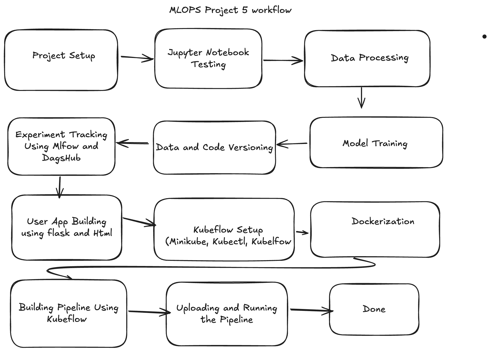

# 🩺 Colorectal Cancer Patient Survival Prediction (MLOps Project 5)

This repository contains the end-to-end implementation of a **Colorectal Cancer Patient Survival Prediction** system using MLOps best practices and tools. The primary goal is to predict the survival probability of patients diagnosed with colorectal cancer based on historical data.

---

---

## 🎯 Project Objective

To build an automated ML pipeline using **Kubeflow**, **Docker**, **Minikube**, and **MLflow + DagsHub** for experiment tracking, version control, and model deployment.

The system will:
- Predict patient survival chances based on clinical features.
- Help hospitals in **patient monitoring**, **resource allocation**, and **clinical trial planning**.
- Be deployable as a user-friendly Flask web application.

---

## 📌 Project Highlights

- ✅ Local Kubernetes setup using **Minikube**
- 🐳 **Dockerization** and container management
- 🔁 **Experiment tracking** using **MLflow** integrated with **DagsHub**
- 📦 **Version control** using GitHub (and optionally DVC)
- 📊 **Model training pipelines** using **Kubeflow Pipelines**
- 🧪 Testing and EDA in **Jupyter Notebooks**
- 🌐 Web app interface using **Flask + HTML**
- ☁️ Deployment-ready Docker images pushed to **Docker Hub**

---

## 🏥 Real-World Use Cases

1. **Patient Monitoring**: Track patient health over time and warn against deteriorating conditions.
2. **Resource Allocation**: Help hospitals prioritize critical patients with low survival predictions.
3. **Surgical Decision Support**: Advise clinicians to upgrade treatment methods based on predictive insights.
4. **Clinical Trials**: Identify suitable candidates for trials of new therapies.

---

## 🔧 Workflow Overview

1. **Project Setup**: Define folder structure, virtual env, config, and custom modules.
2. **Jupyter Notebook Testing**: Initial testing and exploration of the dataset.
3. **Data Processing**: Clean, transform and engineer features.
4. **Model Training**: Train and validate survival prediction models.
5. **Data & Code Versioning**: Store code and data (via GitHub or DVC).
6. **Experiment Tracking**: Use MLflow + DagsHub for logging model performance.
7. **User App**: Flask-based app for easy interaction with model.
8. **Kubeflow Setup**: Install and configure Minikube, kubectl, and Kubeflow locally.
9. **Dockerization**: Containerize the project and push to Docker Hub.
10. **Pipeline Creation**: Define pipeline components using Python, generate YAML.
11. **Upload & Run**: Use Kubeflow Dashboard to upload YAML and run the training pipeline.
12. **Done**: Obtain a trained Docker image for deployment on any Kubernetes service.

---

## 📁 Dataset

- **Source**: [Kaggle](https://www.kaggle.com/)
- **Data**: Colorectal Cancer Global Dataset (~167,000 rows)
- **Target**: Patient survival (Yes/No)

---

## 🧑‍💻 Tech Stack

- Python, Jupyter Notebook
- Flask, HTML/CSS
- MLflow, DagsHub
- Docker, Docker Hub
- Minikube, kubectl
- Kubeflow Pipelines
- GitHub

---

## 🚀 Future Scope

- Integrate CI/CD pipelines
- Deploy the trained image to GCP (GKE), AWS, or Azure
- Expand to include real-time prediction via REST API

---

## 💬 Note

> This project emphasizes **hands-on learning** of **Kubeflow**, **Minikube**, and **ML systems automation** — essential skills for modern ML engineers.

---

